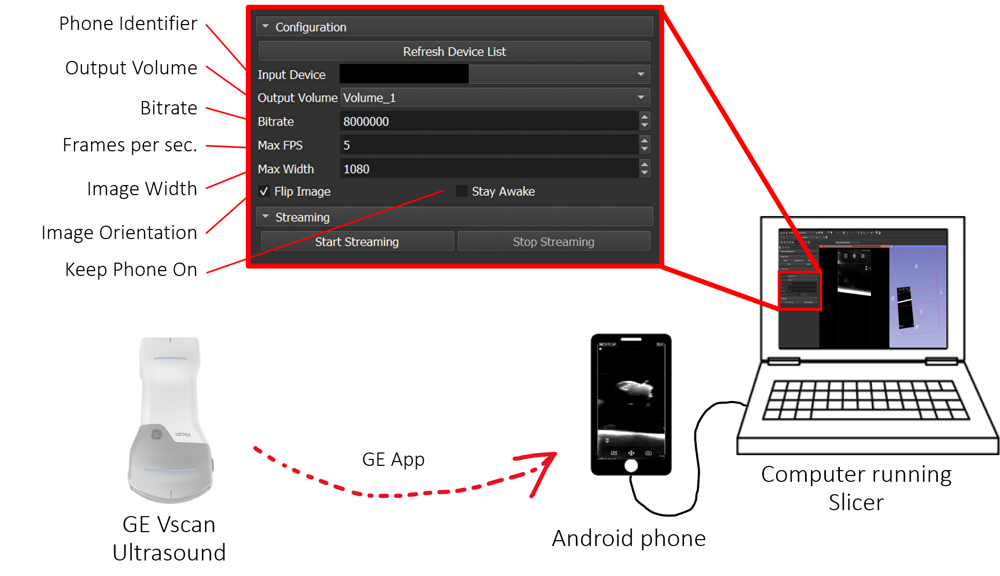

# StreamAndroidExtension
A 3D Slicer extension for streaming the contents of an Android device into a volume node.

# Setup Steps
1. Start by plugging your Android device into the computer.
2. Navigate to the Settings, then Developer Tools menu on your Android device, and find the option to Enable USB Debugging.

Once you load this extension into 3D Slicer, it will automatically pip install a Python version of the Android Debug Bridge into Slicer that will enable you to find and connect to your phone.

# Troubleshooting
It can take multiple tries to enable USB Debugging and have your computer recognize your phone. It may require clicking an "Allow USB Debugging" dialog on your phone, or a similar message on your computer.

To debug whether your computer can access your phone via the Android Debug Bridge, you can run the following Python code (in either a local Python environment with "adbutils" or in slicer with the same package installed):

```python
from adbutils import adb
deviceList = adb.device_list()
print(deviceList)
```

You should see at least one AdbDevice object in the list. If not, try installing [Android Studio](https://developer.android.com/studio?gad_source=1&gclid=CjwKCAjw9cCyBhBzEiwAJTUWNUDJAKI4Ze16R-TkkLXFHuHbukW2-SiWRGuPbhPR4U_Gx0KiPDpAtxoC1Z8QAvD_BwE&gclsrc=aw.ds) and attemting to connect to your phone via the [Android Debug Bridge](https://developer.android.com/tools/adb#howadbworks) on the command line first


# Applications

## Streaming US Images from Wireless Ultrasound
This extension can be used to stream ultrasound images from wireless ultrasound probes that are only able to interface with mobile devices for real-time streaming. 


